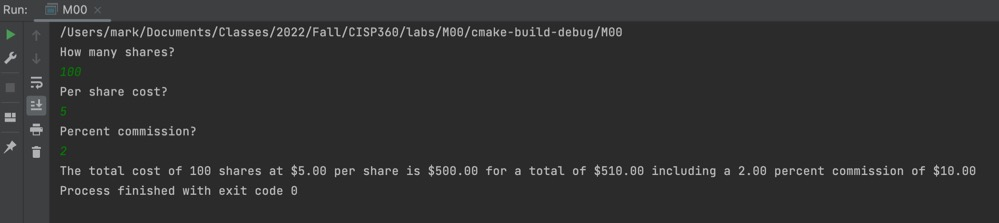

# M00 Lab


```
/**
 * Per lab, display cost of shares, cost of commission, total cost
 *
 * @param int shares Number of shares purchased
 * @param float perShare Cost per share
 */
void kathryn(int shares, float perShare) {
    // 2% commission
    const float fee = 0.02;
    // init vars
    float cost, commission, total;
    // calc cost
    cost = shares * perShare;
    // calc commission
    commission = cost * fee;
    // calc total cost
    total = cost + commission;
    // output all the things
    printf("The total cost of %d shares at $%.2f per share is $%.2f for a total of $%.2f including a %.2f percent commission of $%.2f",
           shares, perShare, cost, total, fee * 100.0, commission);
}

int main() {
    kathryn( 750, 35);

    return 0;
}
```


## Output


## Expanded Program With User Input (no input validation)

```
/**
 * Expanded version that requires user to input values
 */
void anyone() {
    // init vars
    int shares;
    float perShare, cost, fee, commission, total;
    // assign user input to vars
    cout << "How many shares?\n";
    cin >> shares;
    cout << "Per share cost?\n";
    cin >> perShare;
    cout << "Percent commission?\n";
    cin >> fee;
    // convert fee into percent decimal
    fee /= 100;
    // calculations
    cost = shares * perShare;
    commission = cost * fee;
    total = cost + commission;
    // output all the things
    printf("The total cost of %d shares at $%.2f per share is $%.2f for a total of $%.2f including a %.2f percent commission of $%.2f",
           shares, perShare, cost, total, fee * 100.0, commission);
}
```


