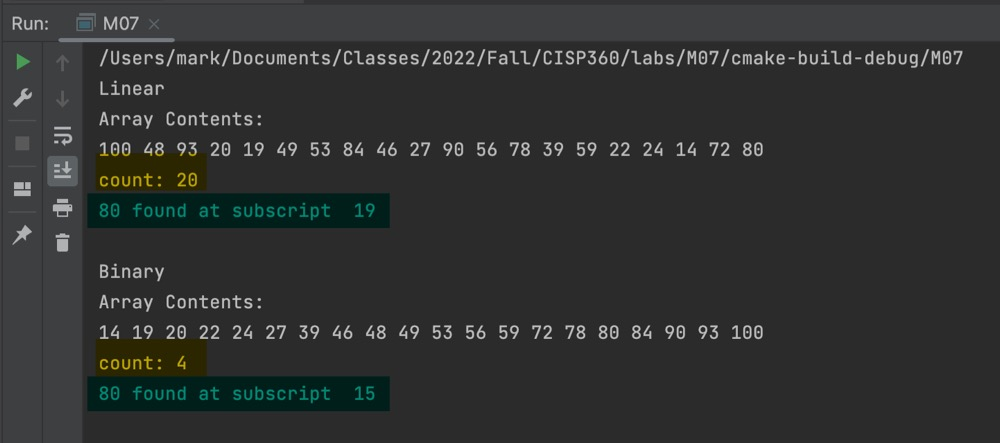
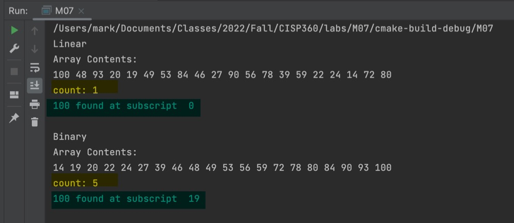
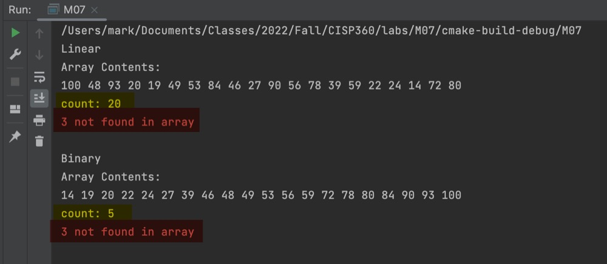

# Module 7 | Lab

```
int main() {
    // Declare and instantiate vars
    int numbers[] = {100, 48, 93, 20, 19, 49, 53, 84, 46, 27, 90, 56, 78, 39, 59, 22, 24, 14, 72, 80, 67};
    int found, needle = 80;

    // Linear Search
    cout << "Linear\n";
    found = myLinearSearch(numbers, 20, needle);
    showResults(found, needle);

    // Binary Search
    cout << "Binary\n";
    found = myBinarySearch(numbers, 0, 19, needle);
    showResults(found, needle);

    return 0;
}
```

## Test Runs







